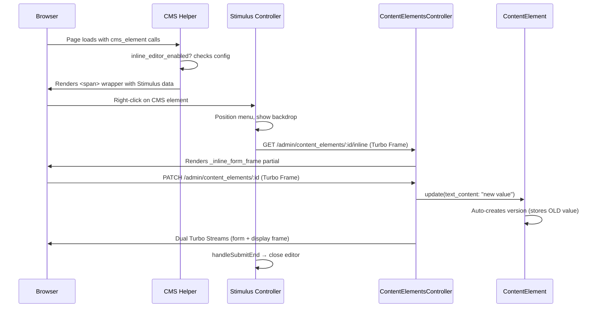

# Inline CMS Content Editing

Right-click any CMS-powered text on a live page to edit it in place. Changes save instantly via Turbo Streams, and auto-versioning captures every edit.

## Prerequisites

CMS must be enabled in your initializer before configuring inline editing:

```ruby
# config/initializers/railspress.rb
Railspress.configure do |config|
  config.enable_cms  # Required for inline editing
end
```

See [CONFIGURING.md](CONFIGURING.md) for details on CMS setup.

## Quick Start

### 1. Import RailsPress JavaScript

Add this line to your host app's `app/javascript/application.js`:

```js
import "railspress"
```

This auto-registers all RailsPress Stimulus controllers (including the inline editor). The engine automatically configures the importmap pins — no manual pin configuration needed.

> **Note:** If you already import `"railspress"` for other features (focal point, image cropping, etc.), you're all set — skip this step.

### 2. Configure the Admin Check

In your host app initializer, set a proc that determines whether the current request should see inline editing controls:

```ruby
# config/initializers/railspress.rb
Railspress.configure do |config|
  config.inline_editing_check = ->(context) {
    # `context` is the view helper context (has access to controller, session, etc.)
    context.controller.current_user&.admin?
  }
end
```

The proc receives the helper context, so you can check authentication, roles, feature flags, or anything available in your views. If the proc raises an error, inline editing silently disables itself.

Set to `nil` (the default) to disable inline editing entirely.

### 3. Add `yield :head` to Your Layout

The inline editor CSS is injected as a `<style>` tag via `content_for :head`. Add this to your application layout if you don't have it already:

```erb
<!-- app/views/layouts/application.html.erb -->
<head>
  <!-- ... other head content ... -->
  <%= yield :head %>
  <%= javascript_importmap_tags %>
</head>
```

### 4. Use `cms_element` in Your Views

Only `cms_element` gets inline editing. `cms_value` remains a raw string helper with no wrapper.

```erb
<%# This gets inline editing when enabled: %>
<%= cms_element(group: "Headers", name: "Homepage H1") do |value| %>
  <h1><%= value %></h1>
<% end %>

<%# This does NOT get inline editing (raw string): %>
<h1><%= cms_value("Headers", "Homepage H1") %></h1>
```

That's it. No extra stylesheets to include and no manual Stimulus controller registration needed in the host app.

## How It Works

### User Flow

1. Admin hovers over CMS content — a subtle dashed blue outline appears
2. Admin right-clicks — a floating editor panel opens at the cursor position
3. Panel shows: element metadata (group, name, version), textarea with current content, Save/Cancel buttons, and "Open in admin" link
4. Admin edits text and clicks Save
5. Content updates on the page instantly (no reload), editor closes
6. A version is automatically created in the admin panel

### Architecture

```
┌─────────────────────────────────────────────────────┐
│  Host App Page                                      │
│                                                     │
│  ┌─ <span data-controller="rp--cms-inline-editor">─┐│
│  │  ┌─ Display Turbo Frame ──────────────────────┐ ││
│  │  │  <h1>Welcome to Our Site</h1>              │ ││
│  │  └────────────────────────────────────────────┘ ││
│  │  ┌─ Context Menu (hidden) ────────────────────┐ ││
│  │  │  ┌─ Form Turbo Frame (lazy) ────────────┐  │ ││
│  │  │  │  textarea + Save/Cancel               │  │ ││
│  │  │  └──────────────────────────────────────┘  │ ││
│  │  └────────────────────────────────────────────┘ ││
│  │  ┌─ Backdrop (hidden) ────────────────────────┐ ││
│  │  └────────────────────────────────────────────┘ ││
│  └─────────────────────────────────────────────────┘│
└─────────────────────────────────────────────────────┘
```



### Key Design Decisions

| Decision | Choice | Why |
|----------|--------|-----|
| Wrapper element | `<span style="display:contents">` | Valid inside `<h1>`, `<p>`, and block elements. Zero layout impact. |
| CSS delivery | Injected `<style>` tag | Zero host app configuration. Helper renders once per page. |
| Form loading | Lazy (on first right-click) | No network requests until admin actually wants to edit. |
| Multi-editor | One at a time | Opening a new editor closes any existing one. |
| Duplicate elements | Random suffix frame IDs | `SecureRandom.hex(4)` ensures uniqueness when same element appears multiple times. |
| Content update | Dual Turbo Streams | Controller returns two `turbo_stream.replace` — form frame + display frame. |
| Image elements | Excluded | Only text-type elements get inline editing for now. |

## File Reference

### New Files

| File | Purpose |
|------|---------|
| `app/javascript/railspress/controllers/cms_inline_editor_controller.js` | Stimulus controller: right-click handling, menu positioning, lazy loading, close behavior |
| `app/views/railspress/admin/content_elements/_inline_form.html.erb` | The edit form: metadata, errors, textarea, Save/Cancel/Open in admin |
| `app/views/railspress/admin/content_elements/_inline_form_frame.html.erb` | Turbo Frame wrapper around the inline form |

### Modified Files

| File | What Changed |
|------|-------------|
| `lib/railspress.rb` | Added `inline_editing_check` config attribute + convenience accessor |
| `app/helpers/railspress/cms_helper.rb` | Added `inline_editor_enabled?`, `inline_wrapper_for`, `cms_element_display_frame`, CSS injection |
| `app/controllers/railspress/admin/content_elements_controller.rb` | `update` returns dual Turbo Streams for inline; `inline` passes frame IDs |
| `app/javascript/railspress/controllers/index.js` | Registered `CmsInlineEditorController` |
| `app/javascript/railspress/index.js` | Registered `CmsInlineEditorController` |

### Pre-existing (Unchanged)

| File | Relevance |
|------|-----------|
| `config/routes.rb:10-14` | `get :inline` member route already existed |
| `config/importmap.rb` | Auto-discovers controllers via `pin_all_from` |
| Model auto-versioning | Stores previous `text_content` on save — no changes needed |

## Component Details

### Configuration (`lib/railspress.rb`)

```ruby
# The inline_editing_check proc receives the view helper context.
# Return true to enable inline editing for the current request.
Railspress.configure do |config|
  config.inline_editing_check = ->(context) {
    context.controller.current_user&.admin?
  }
end

# Disable entirely (default):
config.inline_editing_check = nil
```

### CMS Helper (`app/helpers/railspress/cms_helper.rb`)

Key public methods:

- **`cms_element(group:, name:, html_options: {}, &block)`** — Main entry point. When inline editing is enabled and the element is a text type, wraps output in a Stimulus-controlled `<span>`. Otherwise returns the value or block result directly.

- **`inline_editor_enabled?`** — Calls `Railspress.inline_editing_check` with `self` (helper context). Returns `false` if proc is nil, returns false, or raises.

- **`cms_element_display_frame(content_element, display_frame_id)`** — Renders a `<turbo-frame>` with the element's current value. Used by the controller to replace display content after save.

Key private methods:

- **`inline_wrapper_for(content_element, rendered_content)`** — Builds the full wrapper: `<span>` with Stimulus data attributes, display Turbo Frame, hidden context menu with form Turbo Frame, and hidden backdrop.

- **`inject_inline_styles`** — Injects the `INLINE_EDITOR_CSS` constant as a `<style>` tag via `content_for :head`. Uses a flag (`@_rp_inline_styles_injected`) to ensure it only runs once per request.

### Stimulus Controller (`cms_inline_editor_controller.js`)

**Identifier:** `rp--cms-inline-editor`

**Targets:**
- `menu` — The floating editor panel
- `frame` — The Turbo Frame inside the menu (lazy-loaded)
- `backdrop` — The overlay behind the menu

**Values:**
- `inlinePath` (String) — GET path for lazy form loading
- `frameId` (String) — Display Turbo Frame ID
- `formFrameId` (String) — Form Turbo Frame ID
- `elementId` (Number) — Content element database ID
- `loaded` (Boolean, default: false) — Whether form has been loaded

**Actions:**
- `open` (contextmenu) — Closes other editors, lazy-loads form, positions menu, shows backdrop
- `close` (Escape, backdrop click, Cancel button) — Hides menu + backdrop, removes listeners
- `handleSubmitEnd` (turbo:submit-end) — Closes on success, resets loaded flag for fresh data next time

**One-at-a-time behavior:** `open` queries all visible `.rp-inline-menu` elements, finds their parent controllers via `this.application.getControllerForElementAndIdentifier`, and calls `close()` on each.

**Viewport-aware positioning:** `positionMenu(x, y)` constrains the menu within 8px of all viewport edges.

### Controller (`content_elements_controller.rb`)

**`inline` action:**
- With `Turbo-Frame` header: renders `_inline_form_frame` partial with `form_frame_id` and `display_frame_id` from params
- Without header: redirects to full edit page

**`update` action (inline path):**
- With `Turbo-Frame` header and successful save:
  1. Clears CMS helper cache
  2. Builds array of Turbo Streams:
     - `turbo_stream.replace(form_frame_id, ...)` — replaces form with fresh copy (updated version count)
     - `turbo_stream.replace(display_frame_id, ...)` — replaces display content with new value
  3. Renders as `turbo_stream` response
- With errors: replaces form frame only, with `:unprocessable_entity` status

### Inline Form (`_inline_form.html.erb`)

Shows:
- **Metadata row:** group name (blue badge), element name, version count
- **Validation errors** (if any, red box)
- **Form:** textarea pre-filled with current `text_content`, hidden fields for frame IDs
- **Actions:** Save (blue), Cancel (grey, calls `rp--cms-inline-editor#close`), "Open in admin" (link to full edit page, opens in new tab)

### CSS (`INLINE_EDITOR_CSS` constant)

All styles use `rp-inline-` prefix. Key elements:

- **Hover indicator:** Dashed blue outline on `[data-controller="rp--cms-inline-editor"]:hover`
- **Backdrop:** Fixed full-screen overlay at z-index 9998
- **Menu:** Fixed position, z-index 9999, white background, rounded corners, shadow
- **Hidden utility:** `.rp-inline-hidden { display: none !important; }`

## Testing

### Running Tests

```bash
# All tests (559 total, including 21 new inline editing tests)
bundle exec rspec

# Just the inline editing tests
bundle exec rspec spec/helpers/railspress/cms_helper_spec.rb
bundle exec rspec spec/requests/railspress/admin/content_elements_spec.rb
```

### Test Coverage

**Helper specs** (`spec/helpers/railspress/cms_helper_spec.rb`):
- Wraps content in `<span>` with Stimulus controller data attributes
- Includes `display:contents` style
- Includes all Stimulus data values
- Includes `contextmenu` action
- Includes display `<turbo-frame>`
- Includes hidden menu and backdrop
- Generates unique frame IDs for duplicate elements
- Does not wrap when inline editing is disabled
- Does not wrap non-existent elements
- Wraps block content
- `inline_editor_enabled?` returns false with no config
- `inline_editor_enabled?` returns true when check returns true
- `inline_editor_enabled?` returns false when check returns false
- `inline_editor_enabled?` returns false when check raises error

**Request specs** (`spec/requests/railspress/admin/content_elements_spec.rb`):
- `GET /inline` renders form frame with Turbo-Frame header
- `GET /inline` redirects without Turbo-Frame header
- `GET /inline` redirects for deleted elements
- `PATCH /update` returns turbo stream for inline update
- `PATCH /update` updates element text content
- `PATCH /update` creates version on inline update
- `PATCH /update` returns turbo stream with errors for invalid inline update

## Demo Page

Start the dummy app and visit the demo page:

```bash
cd spec/dummy && bundle exec rails server -p 3001
# Visit http://127.0.0.1:3001/pages
```

The demo page has:
- An "Inline Editing Active" banner at the top
- Multiple `cms_element` calls (Headers, Homepage, Footers groups) that all get inline editing
- `cms_value` calls that remain plain text (no editing)
- A content inventory table showing all CMS elements

## Known Limitations

- **Mobile/touch:** No right-click on touch devices. Long-press or visible edit button is a future enhancement.
- **Image elements:** Only text-type elements are editable inline. Image editing requires the admin panel.
- **Concurrent edits:** Last-write-wins. Version history preserves the audit trail.
- **CSP strict mode:** Inline `<style>` tag and `style="display:contents"` may need adjustment for strict Content Security Policy environments.
- **z-index conflicts:** Menu uses z-index 9999, backdrop 9998. Host apps with higher z-index values may overlap the editor.
- **Multi-instance update:** When the same element appears multiple times on a page, only the edited instance's display frame updates. Other instances show the old value until page reload.

## Future Enhancements

- Touch support (long-press or visible edit icon)
- Image element inline editing (file upload widget)
- Keyboard accessibility (aria-role="dialog", focus trap)
- Multi-instance update (update all display frames for the same element)
- Unsaved changes warning
- Success feedback (brief "Saved" toast)
- CSP-compatible styling (CSS custom properties instead of inline styles)
